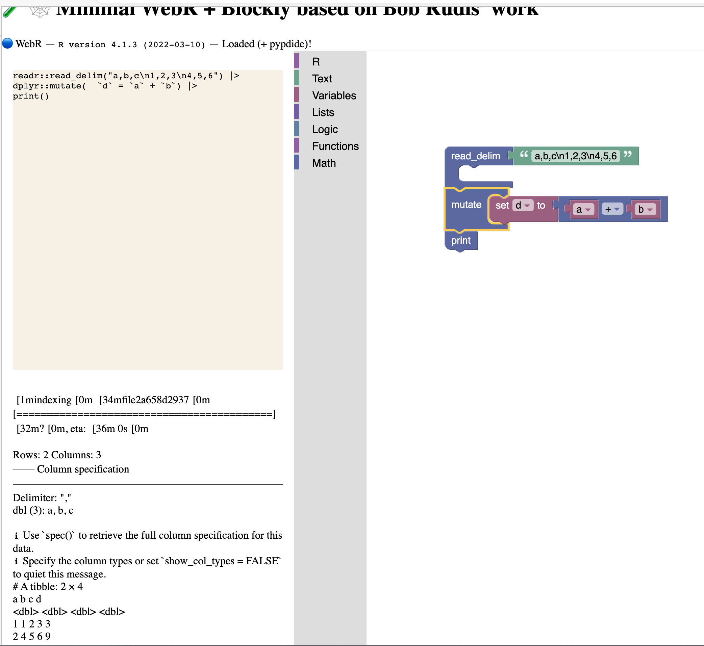

# 🧪 🕸️ Minimal WebR + Blockly based on Bob Rudis' work

# Acknowledgements

First, thank you to [Bob Rudis](https://github.com/hrbrmstr) and his webr code, especially [https://github.com/hrbrmstr/slightly-more-than-minimal](https://github.com/hrbrmstr/slightly-more-than-minimal).  Second, thanks to [George Stagg](https://github.com/georgestagg) for [WebR](https://docs.r-wasm.org/webr/latest/).  Thanks to [Hadley Wickham](https://github.com/hadley) and all the other authors of the [tidyverse](https://www.tidyverse.org/) for dplyr.  And thanks to the maintainers of [blockly](https://blocklycodelabs.dev/).  I have done basically nothing but glue these tools together (poorly).

#  Warning

This is a proof of concept experiment.  It's in no way well coded or even fully functional.  Everything starts somewhere and this is where this starts.



# Project

## Motivation

Years ago it seemed clear that blockly's ability to connect blocks paired perfectly with dplyr's ability to pipe functions.  I was working on the [Verizon Data Breach Investigations Report](https://verizon.com/dbir) and was looking for a way to make simple DBIR analysis available to everyone.  Almost all DBIR analysis looks like:  
```R
dbir |>
  dplyr::filter(plus.dbir_year==2022, subset.2022dbir) |> # yearly analysis subset
  dplyr::filter(attribute.confidentiality.data_disclosure.Yes) |> # breaches
  verisr::getenumCI("action", ci.method="bootstrap") # analysis query
```
This pattern fits incredibly well with blockly, however at the time, it would have had to be tied to a back end R kernel and anyone able to get an R kernel up and running and connected to the browser, really didn't need blockly for the analysis.  

Fast forward to 2023 and we now have WebR, an ASM implementation of R.  With this we can bring functional data analysis in R to flks w/o needing to write a line of code.

## Concept

The basic concept is to focus on the ability to create or open data, apply a chain of dplyr functions to it, and  view the output.  Maybe we'll add ggplot or vega visualization later.

## Status

Currently, we have a very small number of functions created.  The current project is a combination of Bob Rudis' [https://github.com/hrbrmstr/slightly-more-than-minimal](https://github.com/hrbrmstr/slightly-more-than-minimal) WebR implementation and the codelabs [blockly example app](https://github.com/google/blockly-samples/tree/master/examples/sample-app).  It draws heavily on the example of adding a JSON generator to start adding an R generator.  

At this initial starting point there are a very small number of R functions implemented and a very small number of the existing blockly blocks implemented.  Just enough to provide the concept.  Additionally nothing is particularly tested.  Also, no attempts have been made at efficiency.  Plus, the UI is still copy/paste from the parent projects with basically no clean-up.  And I'm far more proficient with R than with JS.  This is truly a starting point.  You have been warned.

## Future

Hopefully I'll get the opportunity to continue to add blocks (both core and R) until it's far more robust, as well as improving the quality of the code and the user experience.  Only time will tell.